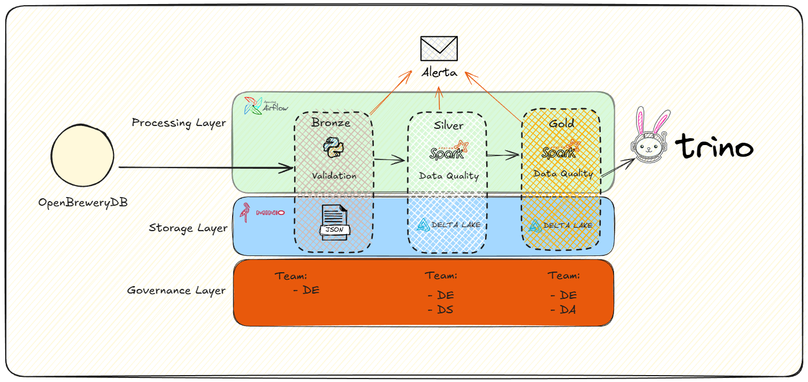

# OpenBreweryDB Lakehouse Data Pipeline

## Project Purpose
This repository contains an end-to-end data engineering solution designed to ingest brewery data from a public API, process and validate that data across medallion layers (`bronze`, `silver`, and `gold`), and expose curated datasets for analytics.

The implementation was intentionally built to support both local execution and cloud-oriented evolution, while preserving a clear separation of concerns between orchestration, processing, quality checks, and infrastructure provisioning.

## Architecture Definition
The project adopts a Lakehouse medallion architecture and the following core components:

- **Airflow** for workflow orchestration
- **Spark** (local) and **AWS Glue** (cloud) for data processing
- **Delta Lake** for transactional table storage
- **MinIO** (local) and **Amazon S3** (cloud) for object storage
- **PyDeequ/Deequ** for data quality validation
- **Hive Metastore** as metadata catalog (local)
- **Trino** as SQL query engine

A single orchestration approach (Airflow) is maintained for both local and cloud paths to keep operational patterns consistent. In a production cloud context, managed orchestration (for example, AWS MWAA) may reduce platform operations at a higher direct cost, while self-managed Kubernetes options (for example, EKS) may provide more flexibility and lower service cost at the expense of increased operational responsibility.

The architecture is intentionally decoupled so individual services can be replaced over time as requirements evolve.



## Data Flow and Layer Responsibilities

### 1. Bronze Layer
The `bronze` layer focuses on **traceability and reproducibility**. Data is ingested from OpenBreweryDB and stored in raw JSON format with minimal transformation. This preserves source fidelity and allows deterministic reprocessing.

Key characteristics:

- Raw payload persistence
- Append-style ingestion
- Source-state preservation at ingestion time

Reference API documentation: [Open Brewery DB Docs](https://www.openbrewerydb.org/documentation)

### 2. Silver Layer
The `silver` layer applies **technical refinement** to produce reliable, standardized datasets.

Main operations include:

- Schema enforcement
- Data cleaning
- Type enforcement/casting
- Column normalization
- Deduplication
- Data quality validation
- Delta conversion

#### Partitioning Strategy

- `execution_date`
- `country`
- `city`

**Rationale:**

- `execution_date` enables idempotent reprocessing.
- `country` and `city` satisfy the challenge requirement for partitioning by location.
- Multi-level partitioning improves pruning efficiency.
- Supports clustering strategies (e.g., Z-ordering) as volume grows.


### 3. Gold Layer
The `gold` layer is the **semantic/analytical layer**, where business-facing shaping is applied.

In this project, `gold` data is aggregated for analytical consumption, and the write strategy uses **upsert semantics** with predefined keys to avoid duplication and preserve consistency.

While the challenge requires aggregation by:

state, city, brewery_type
count(*)

The Gold layer was intentionally extended into a **multi-grain long-format semantic model**.

This elevates the solution from fixed aggregation to a flexible analytical structure.

#### Gold Modeling Strategy

The Gold layer produces a **long-format aggregation table** that supports multiple aggregation levels.

#### Aggregation Levels

- `city_type`
- `state_type`
- `country_type`
- `global_type`

#### Grain Definition

Depending on `aggregation_level`, the grain changes:

| Aggregation Level | Required Dimensions |
|------------------|--------------------|
| city_type | country, state, city, brewery_type |
| state_type | country, state, brewery_type |
| country_type | country, brewery_type |
| global_type | brewery_type |

---

#### Gold Table Schema

| Column | Description |
|--------|-------------|
| aggregation_level | Defines aggregation granularity |
| country | Country dimension |
| state | State dimension |
| city | City dimension |
| brewery_type | Brewery classification |
| metric_name | Metric identifier (currently `brewery_count`) |
| metric_value | Metric value |

---

#### Why Long Format?

This design:

- Supports future metrics without schema change
- Avoids creating multiple gold tables
- Reflects dimensional modeling best practices

### Data Modeling Considerations

The Gold layer was designed with the following principles:

1. Grain Explicitness
Aggregation grain is explicit via `aggregation_level`.

2. Metric Scalability
New metrics can be added without structural redesign.

3. Null Semantics
Higher-level aggregations intentionally set lower-level dimensions to `NULL`.

Example:

| aggregation_level | country | state | city |
|------------------|---------|-------|------|
| state_type | US | CA | NULL |
| country_type | US | NULL | NULL |

NULLs are semantically correct and represent dimensional roll-ups.

## Catalog and Query Engine Rationale
A metadata catalog is essential for governance, discoverability, and scalable consumption. With catalog-driven access, consumers query logical objects (catalog/schema/table) instead of physical paths.

Benefits include:

- Shared schema visibility
- Better lineage and discoverability
- Access policy enforcement by role/user

In local mode, Hive Metastore is used as the catalog due to broad adoption and straightforward integration. In cloud scenarios, alternatives such as AWS Glue Catalog or Unity Catalog are common.

Trino is used as the SQL query engine to simplify analytical access across datasets through federated SQL interfaces.

## Maintenance Considerations

The current architecture is compatible with standard Delta Lake maintenance practices, including `OPTIMIZE` and `VACUUM`, and can be extended with clustering strategies as volume increases. As data grows, periodic compaction and retention cleanup become essential to mitigate small-file fragmentation and preserve query efficiency.

## Performance Considerations
Although OpenBreweryDB itself has a modest volume profile, the platform was designed with scalability in mind.

Key performance considerations:

1. Partition Pruning  
Partitioning by `execution_date`, `country`, and `city` supports selective reads and reduces scan cost for common filter patterns.

2. Upsert Cost in Gold  
`MERGE` operations are naturally more expensive than append-only writes. The impact is reduced through partition-aware filtering and predicate pushdown.

3. Delta Transaction Log Growth  
Transaction log size should be monitored over time. Periodic checkpointing and `VACUUM` policies are recommended to maintain stable performance.

4. Query Engine Efficiency  
The Silver partition strategy is designed to avoid excessive high-cardinality partitioning while remaining compatible with future clustering and layout optimizations.

## Repository Structure

```text
.
├── airflow/
│   ├── dags/
│   │   ├── openbrewerydb_dag.py
│   │   └── openbrewerydb_aws_dag.py
│   ├── include/scripts/
│   ├── logs/
│   └── plugins/
├── data_pipeline/
│   ├── etl.py
│   ├── shared/logger.py
│   └── strategies/
├── infra/
│   ├── airflow/
│   ├── bronze_container/
│   ├── spark/
│   ├── hive/
│   ├── trino/
│   └── terraform/aws/
├── scripts/
│   ├── bronze.py
│   ├── main.py
│   ├── register_table_trino.sh
│   └── ci.sh
├── tests/
├── docker-compose.yaml
├── pyproject.toml
├── start-platform.sh
└── stop-platform.sh
```

For larger teams, this monorepo structure can be split into dedicated repositories (for example: orchestration, processing, and infrastructure) to improve ownership boundaries and release independence.

## Prerequisites

- Docker + Docker Compose
- Python 3.11
- Poetry 2.1.4
- Terraform 1.14.6

## Environment Configuration

1. Use `.env` (not versioned) for secrets and runtime variables.
2. Use `.env.example` as a baseline template.
3. Keep non-sensitive Airflow settings in `infra/airflow/airflow.env`.
4. Inject sensitive values through `docker-compose.yaml` from `.env`.

Common variables include:

- `MINIO_USER`, `MINIO_PASSWORD`
- `AWS_S3_ENDPOINT`, `AWS_S3_ACCESS_KEY`, `AWS_S3_SECRET_KEY`, `AWS_S3_REGION`
- `AIRFLOW_FERNET_KEY`, `AIRFLOW_WEBSERVER_SECRET_KEY`
- `DISCORD_WEBHOOK_URL`

## DAGs and Shared Utilities

The Airflow layer includes two equivalent pipelines for different execution targets:

- **Local DAG:** `airflow/dags/openbrewerydb_dag.py`
- **AWS DAG:** `airflow/dags/openbrewerydb_aws_dag.py`

Reusable helpers are centralized in:

- `airflow/include/scripts/dag_base.py`
- `airflow/include/scripts/aws_dag_base.py`

These helpers provide shared behavior for notifications, SLA callbacks, and operational validation checks.

## Running the Local Platform

The local stack is orchestrated through dedicated helper scripts.

Start all services (including preparation, permission setup, and build):

```bash
bash start-platform.sh
```

Stop all services:

```bash
bash stop-platform.sh
```

Stop services and remove volumes:

```bash
bash stop-platform.sh --volumes
```

### Local Endpoints

- Airflow: `http://localhost:8080`
- MinIO Console: `http://localhost:9001`
- Spark Master UI: `http://localhost:9090`
- Trino: `http://localhost:8085`

## Executing the Local DAG

1. Open the Airflow UI.
2. Enable `openbrewerydb_dag`.
3. Trigger a manual run.
4. Monitor task execution:
   - `bronze__breweries`
   - `silver__breweries`
   - `gold__breweries`

## Registering Tables in Trino

After `silver` and `gold` datasets are generated, register tables in the metadata layer:

```bash
bash scripts/register_table_trino.sh silver breweries
bash scripts/register_table_trino.sh gold breweries
```

## Implementation Approach

Processing code is based on the **Strategy pattern** to keep ETL orchestration generic while allowing each layer to define its own concrete behavior.

Per-layer strategy groups:

- `extract`
- `transform`
- `quality`
- `load`

A strategy registry maps layer names to the corresponding strategy set, promoting maintainability and clean extensibility.

Logging is centralized via `data_pipeline/shared/logger.py` to ensure consistent structured logs across the pipeline.

## Linting and Formatting

Ruff is used as the primary static-quality tool for:

- Linting
- Formatting
- Import ordering

## Testing

Unit tests are located in `tests/` and cover:

- Layer strategy behavior
- Registry behavior
- Integration points with stubs for external dependencies (Spark, Deequ, boto3, etc.)

Run tests directly:

```bash
poetry run pytest -v
```

Run the full local CI script:

```bash
bash scripts/ci.sh
```

The CI script executes:

- Ruff check/fix
- Ruff format
- Pytest with coverage
- Coverage gate (minimum 70%)

## CI (GitHub Actions)

Workflow file: `.github/workflows/ci.yml`

Primary responsibilities:

- Enforce linting and formatting standards
- Execute tests with coverage validation
- Publish coverage artifacts
- Send final Discord notification with job status (`success`/`failure`)

Performance optimizations included:

- `pip` cache
- Poetry and `.venv` cache

## Terraform (AWS)

Terraform under `infra/terraform/aws` provisions the cloud equivalent of the local platform.

Provisioned components include:

- S3 buckets (`bronze`, `silver`, `gold`, `scripts`, `athena-results`)
- ECS/Fargate (Bronze execution)
- Glue Jobs (Silver and Gold)
- Glue Crawlers and Glue Catalog
- Athena Workgroup
- Base networking (VPC/subnets/security groups) and IAM

Execution steps:

```bash
cd infra/terraform/aws
terraform init
terraform plan
terraform apply
```

Additional details are documented in `infra/terraform/aws/README.md`.

## Evolution Opportunities

Potential next steps for platform evolution include:

- Small-file management: prioritize a compaction strategy in the Silver layer.
- Migrating Airflow to a managed service or Kubernetes-based deployment
- Expanding processing capacity with managed Spark services (Glue/EMR)
- Extending the platform for ML and MLOps workloads
- Adding analytical and operational dashboards
- Introducing streaming ingestion for near real-time data flows

These directions are compatible with the current architecture due to its decoupled design.
